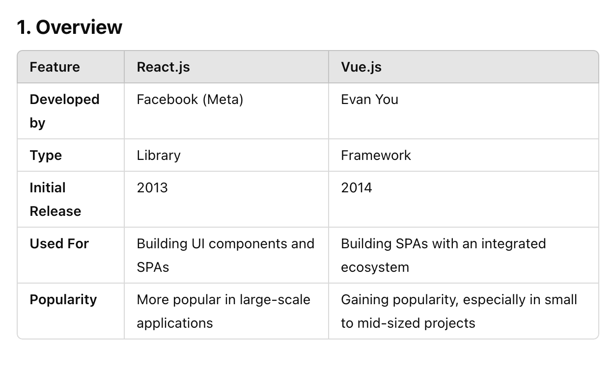
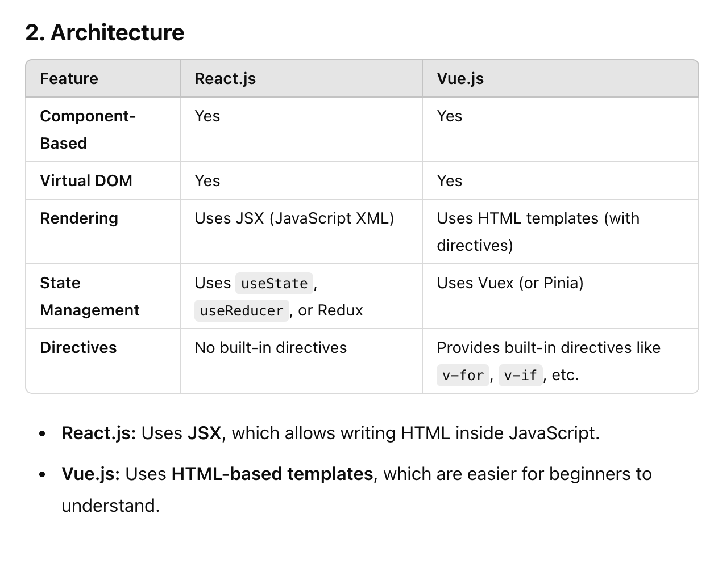
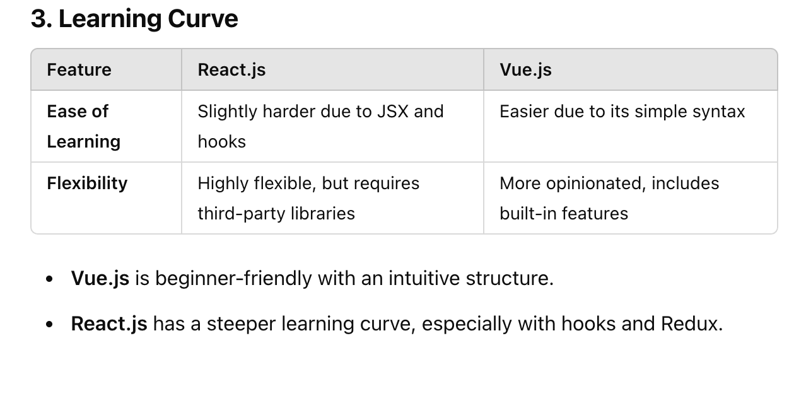
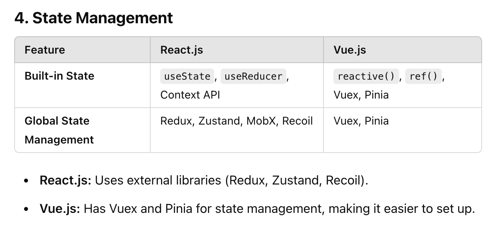
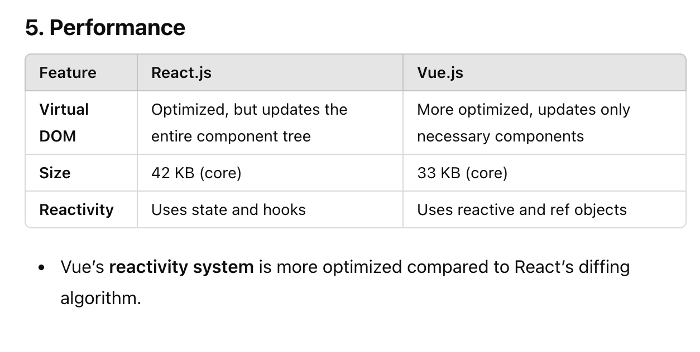
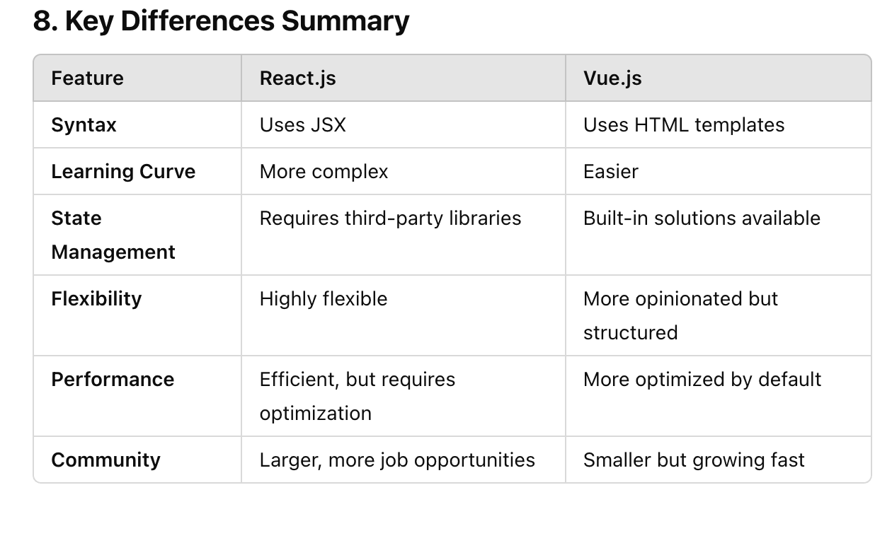

# vueCode
Creating the repo to track my vue.js learning

# Definition of Vue.js
- A Javascript framework for building web user interfaces.
- A rich, incrementally adoptable ecosystem that scales between a library and fully-featured framework.
- Builds on top of the standard HTML, CSS and JavaScript with intuitive API and world-class documentation
- A reactive, complier-optimized rendering system that rarely requires manual optimization.

# Let's createApp using the CDN of Vue.js
-  
-  const {createApp} = Vue;
             const myapp = createApp({
                data(){
                    return {
                        message:"I am learning Vue.js",
                        name:"Appu kumar"
                    }
                }
             })

             myapp.mount("#app");

# Looping in HTML with directive in Vue.js
- Special kind of the attributes that modifies element behaviour
- Directive starts with v- prefix
- Add dynamic functionality
- Used in Vue.js, Angular, Svelte
- Immediately modfies the dom
- eg. v-if, v-for etc.

# Difference between React.js and Vue.js

# Nested if-else directives
- v-if  v-else
- v-if v-else-if v-else ...

# Event Handling & View Model
- By using v-on and v-bind to make page interactive or reactive
- How v-model directive can be used in place of v-on and v-bind to create a two-way binding.

# v-model  two-way binding
- Bind the data with value of input tag.
- Update the value on value change.

# @click and v-on:click
- Both are same.

# Passing the parameters and $event to the method
- You need access to event properties (event.target, event.preventDefault(), etc.).
- You want to modify event behavior based on the event type.
- $event is required when passing custom arguments so that Vue still provides access to the original event object.
- If no arguments are passed, Vue automatically injects the event object.
- It is useful for handling native events inside methods while also using additional parameters.

# watch option
- In Vue, the watch option lets you observe changes to a specific data property and execute a function when the property changes.
- Running asynchronous operations (e.g., API calls).
- Watching nested objects or arrays for changes.
- Performing side effects when data updates.

- How It Works?
- 1 count is a data property (data()).
- 2 In watch, we observe count.
- 3  When count changes, Vue automatically calls the watch function.
- 4 The function receives two parameters:
- 4.1 newValue → the updated value.
- 4.2 oldValue → the previous value.

# Important about watch option
- Can watch Have the Same Name as a Variable?
- Yes! In watch, the method name should match the data property it is watching.

# Best Example of the watch
- API call
- Side Effect like useEffect(()=>{},[])
- Search Query (searching functionality)
- Input value change

# computed option in Vue.js
- Use computed for derived values that need to be cached and updated reactively.
- Use watch for side effects such as API calls, event listeners, or debounced actions.
- If you need both, you can combine them for maximum efficiency.
- eg. firstName and lastName---->fullName  use fullName as variable in ui layer measn where we are mounting

- fullName is a computed property, but it behaves like a variable.
- When we write {{ fullName }} in the template, Vue automatically calls the computed function and displays the returned value.
- We do not need to call it as a function (fullName())—Vue handles it automatically.

- eg. calculating totalPrize of card in E-commerce
- computed properties are designed to derive and return values dynamically based on reactive data.
- They act like virtual properties that derive a new value from existing data.

- {{fullName}} actually we are callingthe fullName but no need to put fullName() Vue.js automatically handle this

# Now create the project with the help of the vite
- npm create vue@3  or npm create vite@latest
- install volar to get notification of element of vue.js

# SFC
- A Single File Component (SFC) in Vue.js is a .vue file that contains the HTML, CSS, and JavaScript needed for a component in a single file.

- Why Use Single File Components (SFC)?
- Encapsulation – Everything (template, logic, styles) is in one file.
- Reusability – Components can be reused across the app.
- Scoped Styles – CSS applies only to the specific component.
- Better Code Structure – Easier to read and maintain.

# SFC is divided in 3 parts
- 1. script-->For importing component
- 2. template for html
- 3. style for css check eg.

# Option API and Composition API
- Options API (export default) with normal , the Composition API ()

# Why Use Vite Instead of Webpack?
- If you write the code in script tag and put in html, no need of the build tool like vite or webpack
- Faster development (Instant HMR).
- Less configuration needed.
- Smaller and optimized production builds.
- Better for modern JavaScript frameworks (Vue, React, Svelte, etc.).

# Assignment
- Given by the Umesh
- userValidation 

# custom component
- Getting props in props property
- Passing the props from App.vue to custom component or one component to another component
- Registering the component in the parent eg. component(App.vue) inside the components property

# custom event and global method(parent method)
- In Vue.js, custom events allow communication between child and parent components, while global methods provide reusable utility functions accessible throughout the application. Let's explore both in detail.

# custom event(It is like inbuilt event v-on:click,v-on:change etc)
- It is based on the event bubbling. okay
- Events in Vue do not bubble automatically up the component hierarchy like in the DOM.
- Events only travel one level up, from child to direct parent.
- Emitting Custom Events (Child to Parent Communication)
- Use $emit() in the child component to send an event to the parent.
- Listen the event at the parent level
- See the syntactic sugar in the vue.js
- See example App.vue in ActorList component

# What is a Slot in Vue.js?
- A slot in Vue.js is a placeholder inside a child component where parent components can insert their own content.
- To make components more reusable and flexible.
- To allow custom content inside a child component.
- <slot> </slot> provided by the vue.js
- <slot />  we can use like this also okay
- template inside the template is used to match with name slot okay see base-layout component in emitwala project

# Lifecycle Methods in Vue.js
- Vue.js provides lifecycle hooks that allow you to execute code at different stages of a component’s existence. These hooks help in managing data fetching, event binding, DOM manipulation, and cleanup tasks.

# There are four major phases in a Vue component’s lifecycle:
- V.V.Imp Creation Phase – Component is being created, but not yet added to the DOM.
  - created()
  - Runs after data and methods are set up (but before DOM is available). Useful for API calls.
- V.V.IMP Mounting Phase – Component is inserted into the DOM.
  - mounted()
  - Runs after component is added to the DOM (perfect for DOM manipulation).
- Updating Phase – Component reacts to changes and re-renders.
  - updated()
  - Runs after Vue updates the DOM (useful for responding to UI changes).
- Unmounting Phase – Component is removed from the DOM.
  - unmounted()
  - Runs after component is removed from the DOM.

# Set up the  SSH key with greytip's project
- 1. Step 1: Check for an Existing SSH Key
  - ls -al ~/.ssh
- 2. Step 2: Generate a New SSH Key
  - ssh-keygen -t ed25519 -C "your-email@example.com"
- 3. Step 3: Add SSH Key to SSH Agent
  - eval "$(ssh-agent -s)"
  - ssh-add ~/.ssh/id_ed25519
- 4. Step 4: Add SSH Key to GitHub
  - cat ~/.ssh/id_ed25519.pub
  - Go to GitHub → Settings → SSH and GPG keys
  - GitHub SSH Keys Settings
  - Click New SSH Key → Paste your key → Add SSH Key.

# Install brew 
- To download application in (mac and linux)

# Install Python 3.11
- export PYENV_ROOT="$HOME/.pyenv"
[[ -d $PYENV_ROOT/bin ]] && export PATH="$PYENV_ROOT/bin:$PATH"
eval "$(pyenv init -)"
- pyenv --version
- pyenv install {python-version}
- to install python 3.9
- pyenv install 3.9
- pyenv versions(list all the versions of the python in this env)
- If you want to set any python version globally, you can use
- pyenv global (python version)

# pycharm IDE for Python

# Some basic commands of postgresql and docker
- \q   # Exit psql
- \l   # To list all the dbs
- exit # Exit the Docker container
- 1. psql -U $(whoami) -h localhost -p 5432 -d postgres  # login using the computer username then create default postgres user or any user ok
    - CREATE ROLE postgres WITH SUPERUSER CREATEDB CREATEROLE LOGIN PASSWORD 'yourpassword';
- 2. Restart PostgreSQL
    - After creating the role, restart PostgreSQL:
    - brew services restart postgresql@15
- 3. Login to PostgreSQL
   - psql -U postgres -h localhost -p 5432
- 4. Create a new database
    - create database zaire_mt;   
- 5. Connect to the database
  - \c zaire_mt    
- Run sql script
- psql -U postgres -d zaire_mt -h localhost -p 5432 -f mandatory_sql_script.sql

- # virtaul env
- source .venv/bin/activate    # if virtaul env of python is already created then activate with this command
- deactivate      ---> this command to deactivate the python virtual env

- # To create new virtual environment
- python3 -m venv python_env
- source name_env_kro/bin/activate

- # Changing the host 
- sudo nano /etc/hosts

   

